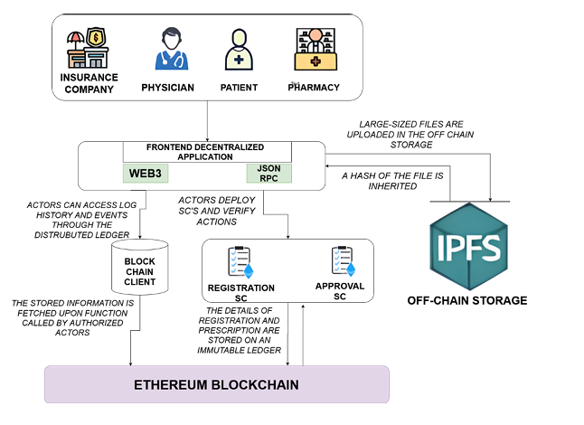
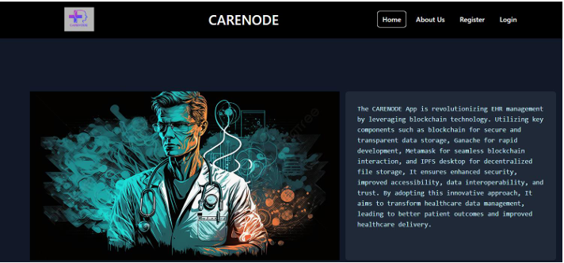
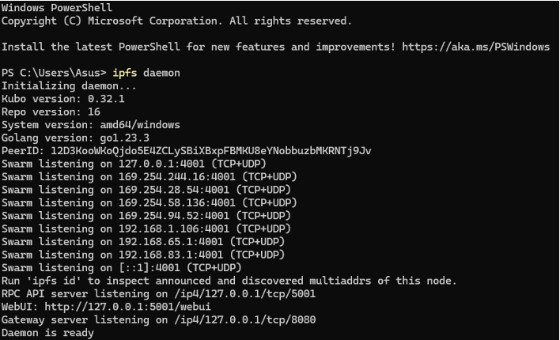
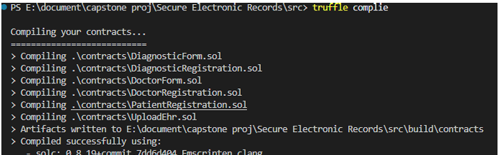
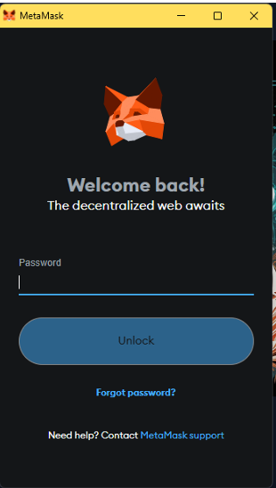
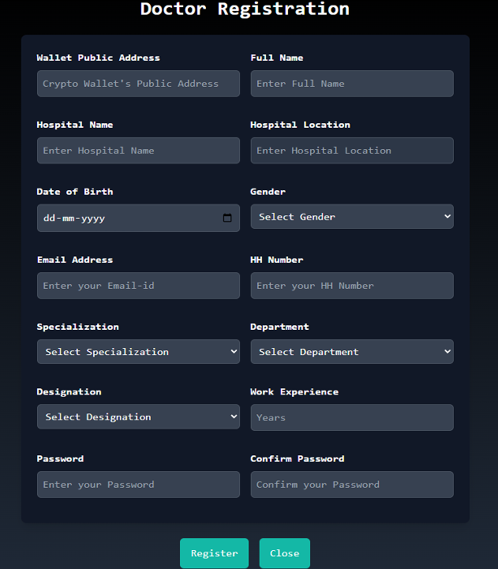
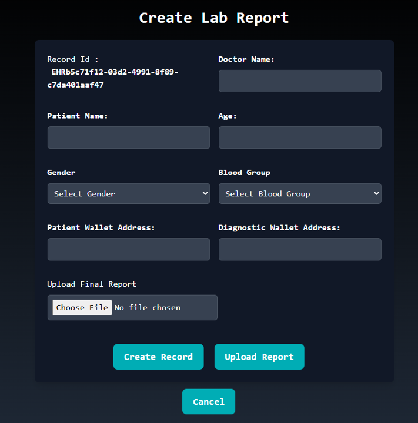

# Decentralized Healthcare System

This repository contains the code and documentation for a decentralized healthcare system leveraging Ethereum smart contracts, Kubo IPFS, Ganache, Truffle, and MetaMask. The project aims to improve data security, privacy, and interoperability in healthcare by storing medical records on decentralized storage and enabling smart contract-based access control.

## 🚀 Features

- 🔐 **Blockchain-backed medical record integrity**
- 🗃️ **Decentralized storage** using Kubo IPFS for high availability and tamper resistance
- ⚙️ **Smart contracts in Solidity** for patient-consented data sharing
- 🧪 **Truffle framework** for testing and deployment
- 🧱 **Ganache** for local Ethereum development
- 🦊 **MetaMask integration** for secure patient/provider interaction

## 🧩 Tech Stack

- Solidity
- IPFS (Kubo)
- Truffle & Ganache
- Ethereum
- MetaMask
- React.js (frontend – if applicable)

---

## 📄 Project Overview

This DApp allows patients and healthcare providers to securely store, share, and access medical records using blockchain and decentralized storage. Access control is enforced via Ethereum smart contracts, and all data is stored on IPFS for tamper resistance and high availability.

---

## ⚙️ Installation

### Prerequisites

- [Node.js & npm](https://nodejs.org/)
- [Truffle](https://trufflesuite.com/truffle/)
- [Ganache](https://trufflesuite.com/ganache/)
- [MetaMask](https://metamask.io/) browser extension
- [Kubo IPFS](https://docs.ipfs.tech/install/)

### Clone the Repository

```bash
git clone https://github.com/Rovinnn/DECENTRALIZED-HEALTHCARE-APPLICATION-USING-BLOCKCHAIN.git
cd DECENTRALIZED-HEALTHCARE-APPLICATION-USING-BLOCKCHAIN
```

### Install Dependencies

```bash
npm install
```

---

## 🏗️ Local Development

### 1. Start Ganache

Open Ganache and start a new workspace or quickstart Ethereum blockchain.

### 2. Start IPFS

Start your local IPFS node (Kubo):

```bash
ipfs daemon
```

### 3. Compile and Deploy Smart Contracts

```bash
truffle compile
truffle migrate
```

### 4. Run the Frontend (if applicable)

```bash
npm start
```

### 5. Connect MetaMask

- Import an account from Ganache into MetaMask.
- Connect MetaMask to the local blockchain (usually http://127.0.0.1:7545).

---

## 🧪 Testing

To run smart contract tests:

```bash
truffle test
```

---

## 📂 Project Structure

- `contracts/` – Solidity smart contracts
- `migrations/` – Truffle migration scripts
- `src/` – Frontend source code (React, if applicable)
- `public/` – Static assets
- `build/` – Compiled contract artifacts
- `README.md` – Project documentation

---

## 📚 Documentation

For a detailed explanation of the system architecture, design decisions, and security considerations, see the included PDF:  
**(https://drive.google.com/file/d/19hztMJ6YGmiD8iEVlaUBypZ8BWM7up-c/view?usp=drive_link)**

---

## 🤝 Contributing

Pull requests are welcome! For major changes, please open an issue first to discuss what you would like to change.

---

## 📄 License

[MIT](LICENSE)

---










#check image folder for other snaps
